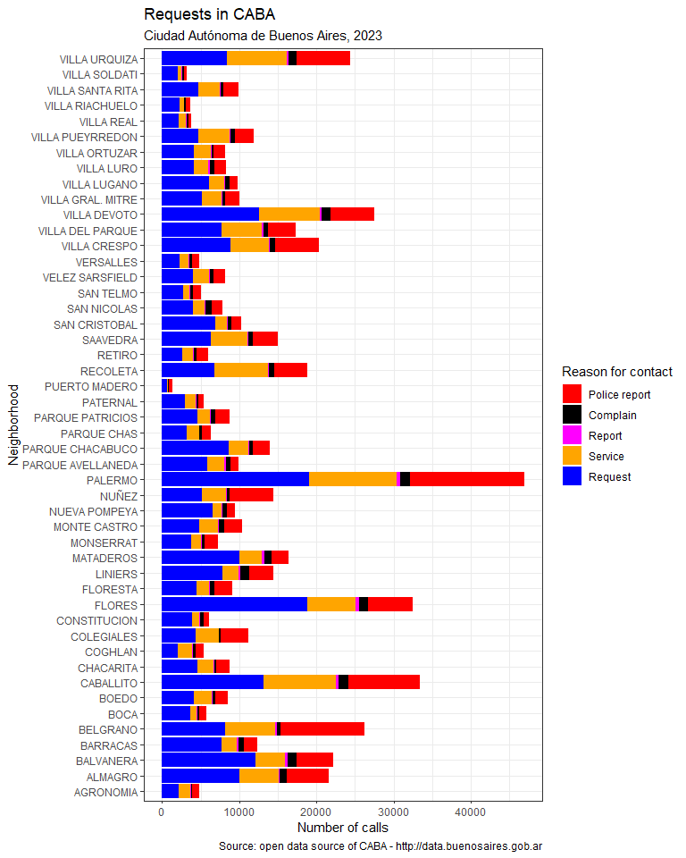
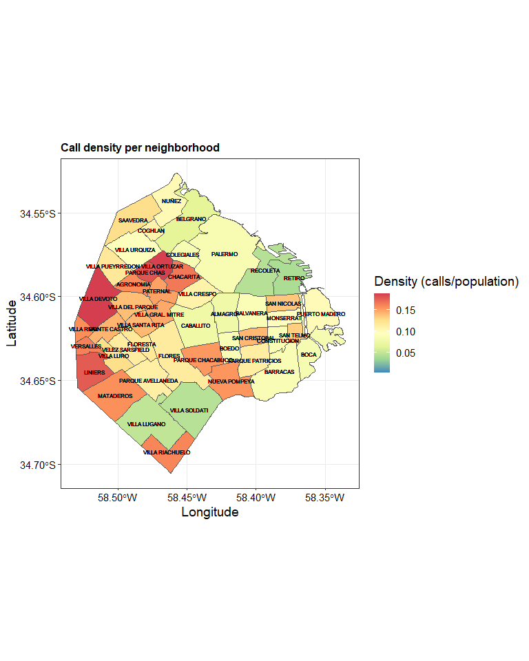
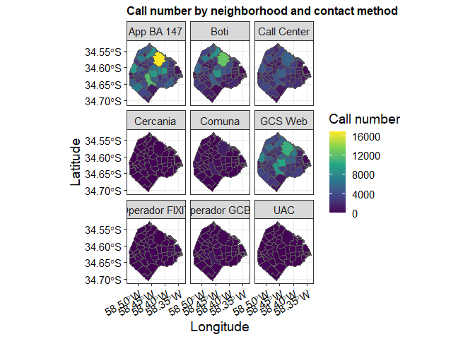
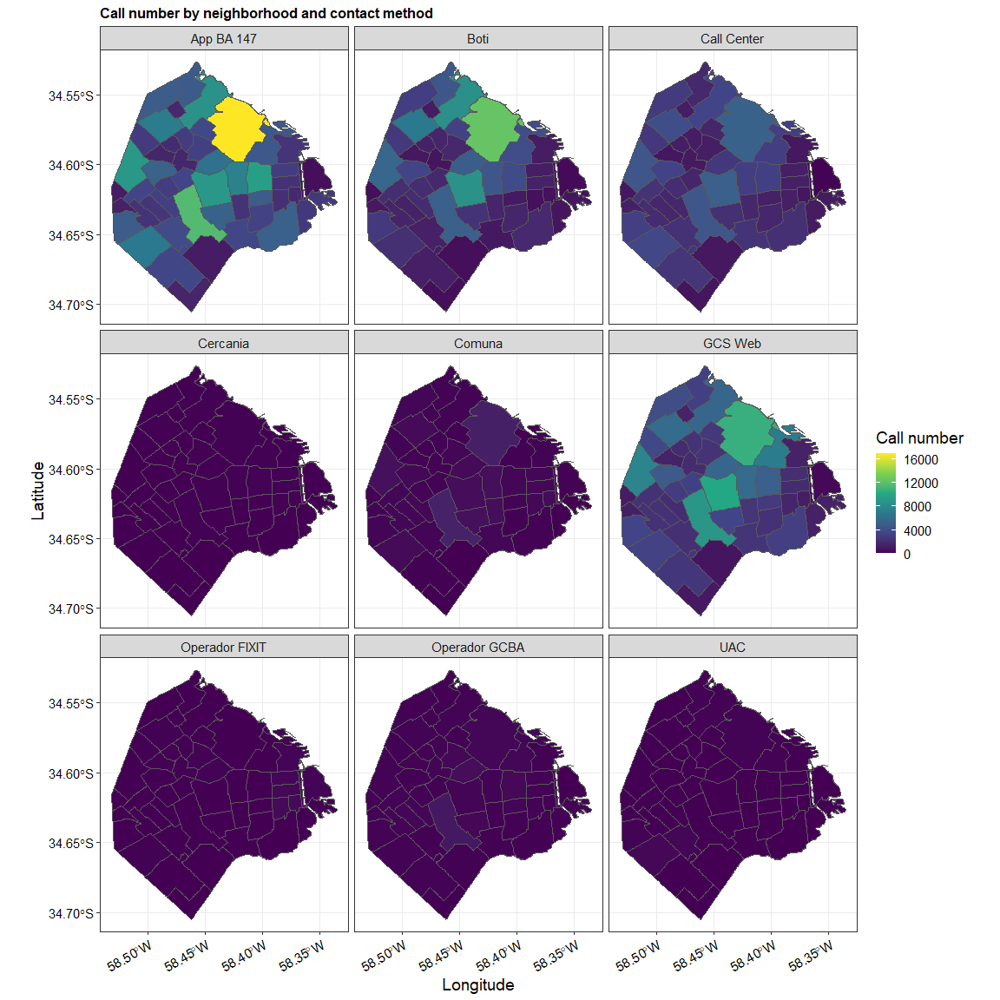

SUACI system analysis - CABA
================

# Aim

Analyze the data gathered by the government regarding the requests and
claims that citizens of the Autonomous City of Buenos Aires (“CABA” in
spanish) perform. What type and amount of requests are made? And where,
neighborhood-wise?

# Import libraries

``` r
library(ggplot2)
library(dplyr)
library(readr)
library(tidyverse)
library(sf)


# Reading data directly from the data sources

#Data
suaci <- read.csv('https://cdn.buenosaires.gob.ar/datosabiertos/datasets/atencion-ciudadana/sistema-unico-atencion-ciudadana/sistema-unico-de-atencion-ciudadana-2023.csv', sep = ';')
#Load for maps: GEOjson from CABA,
barrios <- st_read('http://cdn.buenosaires.gob.ar/datosabiertos/datasets/barrios/barrios.geojson')
```

    ## Reading layer `barrios_badata_wgs84' from data source 
    ##   `http://cdn.buenosaires.gob.ar/datosabiertos/datasets/barrios/barrios.geojson' 
    ##   using driver `GeoJSON'
    ## Simple feature collection with 48 features and 6 fields
    ## Geometry type: MULTIPOLYGON
    ## Dimension:     XY
    ## Bounding box:  xmin: -58.53152 ymin: -34.70529 xmax: -58.33515 ymax: -34.52649
    ## Geodetic CRS:  WGS 84

``` r
#Load population as of 2010 by census. 
poblacion <- read.csv("http://cdn.buenosaires.gob.ar/datosabiertos/datasets/barrios/caba_pob_barrios_2010.csv")

attach(suaci)
attach(barrios)

# Data tidying
suaci = subset(suaci, BARRIO != "") #eliminate rows with absent neighborhood
suaci$BARRIO = iconv(suaci$BARRIO, to='ASCII//TRANSLIT') #Treat special characters, if missing replaced by NA
suaci$BARRIO = suaci$BARRIO %>% replace_na('Nuñez')
#Convert lower to upper case
suaci$BARRIO = toupper(suaci$BARRIO)
suaci$TIPO = recode_factor(suaci$TIPO, 
                        Denuncia = 'Police report', 
                        Queja = 'Complain',
                        Reporte = 'Report',
                        Servicio = 'Service',
                        Solicitud = 'Request')

#For aesthetics
texto_custom = list( theme(
            text = element_text(size=14, color = "black"),
            axis.text.x = element_text(face="plain",size = 11,color="black"),
            axis.text.y = element_text(face="plain", size = 11, color="black"),
            plot.title = element_text(size = 12, face = "bold")))
```

# Number of contacts per neighborhood and per type of contact.

``` r
llamadas = suaci %>% group_by(BARRIO, TIPO) %>%  dplyr::summarise(calls = n())
```

    ## `summarise()` has grouped output by 'BARRIO'. You can override using the
    ## `.groups` argument.

``` r
LLAMADAS.X.BARRIO = ggplot(llamadas) +
    geom_col(aes(x = BARRIO, y = calls, fill= TIPO)) +
    coord_flip()+
      scale_fill_manual(values=c('red', 'black', 'magenta', 'orange', 'blue'))+
     labs(title = "Requests in CABA",
         subtitle = "Ciudad Autónoma de Buenos Aires, 2023",
         caption = "Source: open data source of CABA - http://data.buenosaires.gob.ar",
         x = "Neighborhood",
         y = "Number of calls",
         fill = "Reason for contact")+
    texto_custom + 
    theme_bw() 
```

We can see the number of calls made by the residents of Buenos Aires
City broken down by neighborhood and type of call. The neighborhood that
recorded the highest number of calls was Palermo. Complaints and reports
seem to be the least reason for reaching out.



# Density of calls: number of calls relative to the population number of each neighborhood

``` r
llamadas.pobl = left_join(llamadas, poblacion)
```

    ## Joining with `by = join_by(BARRIO)`

``` r
barrios.dens = left_join(barrios,llamadas.pobl)
```

    ## Joining with `by = join_by(BARRIO)`

``` r
barrios.dens$call_dens =  barrios.dens$calls / barrios.dens$POBLACION
```

``` r
CALLS.DENSITY = ggplot(data.frame(barrios.dens)) +
    geom_sf(aes(fill = call_dens, geometry = geometry)) +
    scale_fill_distiller(palette = "Spectral") +
    xlab("Longitude")+
    ylab("Latitude")+
    ggtitle("Call density per neighborhood") +
    labs(fill = "Density (calls/population)") +
    theme_bw() +
    texto_custom +
    geom_sf_text(data=barrios.dens, aes(label = BARRIO),colour="black",size=2)
```

In this type of graph, we see the map of CABA segmented by neighborhood.
The color scale represents the number of calls normalized by the
population of each neighborhood. This way, we can identify areas with a
higher density of complaints (regardless of the type). This could
contribute to identifying points on the map with higher demand.

    ## Warning in st_point_on_surface.sfc(sf::st_zm(x)): st_point_on_surface may not
    ## give correct results for longitude/latitude data



# How inhabitants prefer to report their needs?

``` r
llamadas.via = suaci %>% 
    group_by(BARRIO, CANAL) %>% 
    dplyr::summarise(calls = n()) %>%
    ungroup()
```

    ## `summarise()` has grouped output by 'BARRIO'. You can override using the
    ## `.groups` argument.

``` r
llamadas.via$combinacion = paste0(llamadas.via$BARRIO,"-",llamadas.via$CANAL)

# Are all combinations of neighborhood and contact method present? 
# Let's add as "0 calls" those who are not.
all.combinations = expand.grid(llamadas.via$BARRIO, llamadas.via$CANAL)
all.combinations$comb = paste0(all.combinations$Var1,"-",all.combinations$Var2)
all.comb = unique(all.combinations$comb)
missing.comb <- data.frame(setdiff(all.comb, llamadas.via$combinacion))
colnames(missing.comb)[1] <- 'combinacion'
missing.comb[c('barrio','canal')] = stringr::str_split_fixed(missing.comb$combinacion, "-",2) 

for (i in (1:nrow(missing.comb))){
    #New row to add to df:
    new.row = data.frame(t(c(missing.comb$barrio[i],
                             missing.comb$canal[i],
                             0,
                             missing.comb$combinacion[i])
                            ))
    colnames(new.row) = colnames(llamadas.via)
    llamadas.via = rbind(llamadas.via, new.row)
}

barrios_via = left_join(barrios, llamadas.via)
```

    ## Joining with `by = join_by(BARRIO)`

``` r
barrios_via$calls =  as.numeric(barrios_via$calls)
```

``` r
BARRIOS.VIA = ggplot(barrios_via) +
    geom_sf(aes(fill = calls, geometry = geometry )) +
    facet_wrap(CANAL ~ ., ncol=3) +
    scale_fill_viridis_c() +
    xlab("Longitude") +
    ylab("Latitude") +
    ggtitle("Call number by neighborhood and contact method") +
    labs(fill = "Call number")+
    theme_bw() +
    texto_custom +
    theme(axis.text.x = element_text(angle = 30, hjust = 1, vjust = 1))

BARRIOS.VIA 
```

<!-- -->

With this latest analysis, we also assess through maps which
communication channels are more/less requested by the residents of CABA
to contact the authorities. We observe that, by far, the most preferred
methods are the BA 147 application and the government portal on the
internet. In conjunction with this, we see that in-person service
channels (either proximity-based or in the municipal districts, “comuna”
in spanish) are rarely used. This indicates a clear shift in the way
complaints are being submitted.


